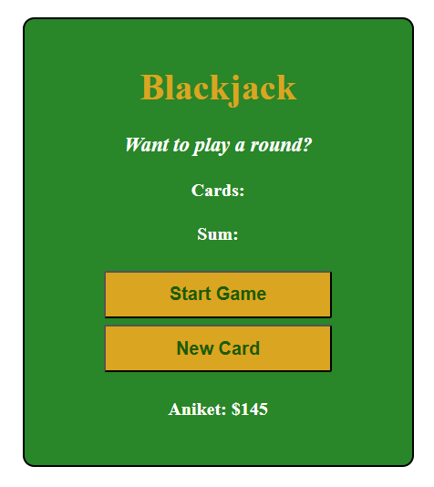

# Blackjack Game

A simple, interactive Blackjack card game built with HTML, CSS, and JavaScript.

## Overview

This is a classic Blackjack game implementation where players try to get a hand value as close to 21 as possible without going over. The game features a clean, user-friendly interface with real-time game updates.



## Features

- **Start Game**: Click "Start Game" to begin a new round with two initial cards
- **Draw Cards**: Click "New Card" to draw additional cards during gameplay
- **Game Logic**:
  - Cards are randomly generated with values 1-13
  - Ace (1) counts as 11
  - Face cards (11-13) count as 10
  - Number cards count as their face value
- **Dynamic Messages**: Get real-time feedback on game status
- **Player Tracking**: Displays player name and chip count
- **Win Condition**: Reach exactly 21 for Blackjack!

## Game Rules

- **Sum ≤ 20**: Game continues - "Do you want to draw a new card?"
- **Sum = 21**: You've won with Blackjack!
- **Sum > 21**: You bust and are out of the game

## How to Play

1. Open `index.html` in your web browser
2. Click **"Start Game"** to receive your first two cards
3. Review your sum and the displayed cards
4. Click **"New Card"** to draw additional cards (if you haven't reached 21 or busted)
5. Try to get as close to 21 as possible without going over!

## Project Structure

```
blackJack/
├── index.html    # Game interface and structure
├── index.js      # Game logic and functionality
├── index.css     # Styling and layout
└── README.md     # This file
```

## File Descriptions

### index.html
Contains the HTML structure with:
- Game title and heading
- Message display for game status
- Card and sum displays
- Player information
- Start Game and New Card buttons

### index.js
Implements the core game logic:
- `startGame()`: Initializes a new game with two random cards
- `newCard()`: Draws a new card when requested
- `renderGame()`: Updates the display with current game state
- `getRandomCard()`: Generates random card values (1-13)
- Player object with name and chip tracking

### index.css
Provides styling with:
- Green card table theme
- Golden accents for titles and buttons
- Centered container layout
- White text for visibility
- Bold and italic message styling

## Default Player

The game comes with a pre-configured player:
- **Name**: Aniket
- **Chips**: 145

You can modify the player object in `index.js` to customize the player name and starting chips.

## Styling Highlights

- **Color Scheme**: Green background with golden accents
- **Font**: Trebuchet MS for a clean, modern look
- **Layout**: Centered, bordered container for focus
- **Interactive Buttons**: Golden buttons with hover-friendly styling

## Browser Compatibility

Works with all modern browsers that support:
- ES6 JavaScript
- DOM manipulation
- CSS flexbox/grid basics

## Future Enhancements

Potential features to add:
- Dealer AI logic
- Betting system
- Score tracking across multiple rounds
- Sound effects
- Animated card dealing
- Responsive mobile design

## License

This is a learning project. Feel free to modify and use as needed.
